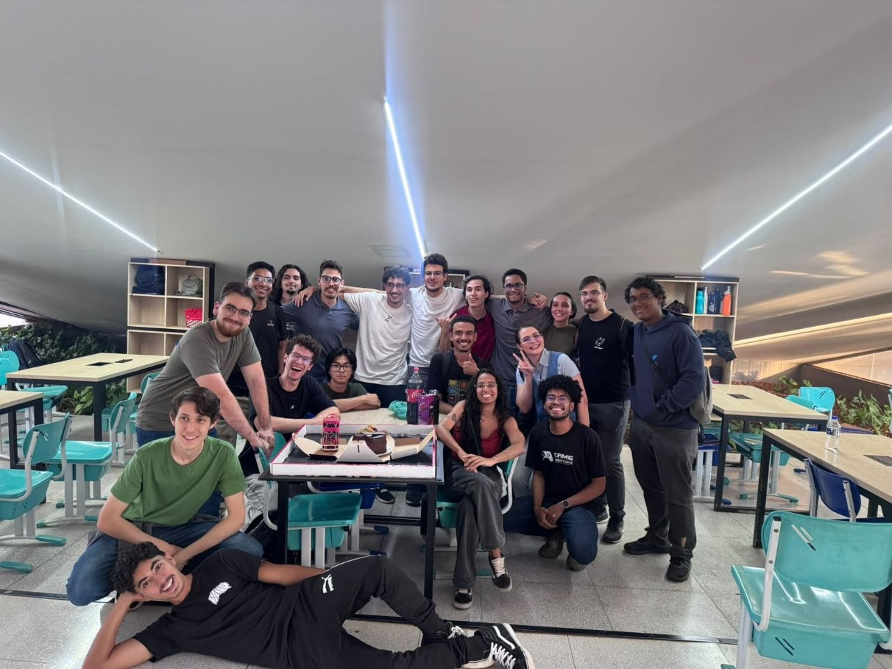

# Micromouse — PI1 2026.1, Grupo 02

Projeto desenvolvido para a disciplina Projeto Integrador 1 (PI1) da FCTE/UnB. O desafio proposto pelos professores: projetar e construir, em equipes de até 20 integrantes, um robô Micromouse capaz de resolver labirintos 4x4 e 8x8 de forma **totalmente autônoma**, sem intervenção humana durante a corrida.

## O desafio

- Labirintos 4x4 e 8x8, com configuração de paredes definida pelos professores no dia da competição.
- Ponto de largada em um canto do labirinto, sorteado no momento da corrida.
- Cada célula do labirinto mede 18 cm de lado, com paredes de 1,2 cm de espessura.
- O objetivo é um bloco de 4 células (2x2) sem paredes entre si, no centro do labirinto.
- O robô precisa mapear o labirinto, alcançar esse bloco central e, em seguida, percorrê-lo pelo caminho mais curto conhecido.

## Estrutura do repositório

O projeto foi dividido em quatro núcleos: Eletrônica, Software, Estrutura e Energia. A organização de pastas segue o [template padrão do PI1](https://github.com/fcte-pi1/template):

| Pasta | Conteúdo |
|---|---|
| [`src/firmware`](src/firmware) | Firmware do Micromouse (ESP32/ESP-IDF): navegação, resolução de labirinto, controle de motores e sensores. |
| [`src/backend`](src/backend) | API (FastAPI) que recebe a telemetria do robô e persiste o histórico das corridas. |
| [`src/frontend`](src/frontend) | Interface web (React) para acompanhar o robô em tempo real durante a corrida. |
| [`hw`](hw) | Esquemáticos, PCBs e datasheets dos componentes eletrônicos. |
| [`mec`](mec) | Modelagem 3D, desenhos técnicos e montagem do chassi e do labirinto. |
| [`docs`](docs) | Documentação do projeto: EAP, relatório técnico, análise de riscos e seleção de componentes. |

## Minha participação

Atuei como **gerente de projeto** e como membro do **núcleo de Eletrônica**, focado no firmware do robô. Minhas principais responsabilidades técnicas foram:

- Firmware de navegação e resolução de labirinto (algoritmo flood-fill), em `src/firmware`.
- Calibração dos sensores (ToF, giroscópio/IMU, encoders) usados na navegação.
- Comunicação do robô com o sistema web (telemetria via Wi-Fi/HTTP durante a corrida).

Como gerente de projeto, coordenei a comunicação entre os quatro núcleos (Eletrônica, Software, Estrutura e Energia), priorizando e sincronizando as atividades que dependiam de mais de um núcleo para reduzir gargalos entre as equipes.

## Fluxo de execução do firmware

O `app_main` do firmware (`teste_navegacao.cpp`) segue, em cada corrida, a seguinte sequência:

1. **Inicialização de hardware** — sobe o barramento I2C (bateria/INA226), inicializa os 3 sensores ToF usados (frontal, esquerda, direita), o giroscópio (MPU9250), os encoders (via PCNT) e os motores. A conexão Wi-Fi é disparada em background, sem bloquear o boot.
2. **Seleção de largada** — com o robô parado, toques curtos no botão único alternam entre as combinações de tamanho do labirinto (4x4/8x8) e lado de largada (esquerda/direita); segurar o botão (≥ 0,7 s) confirma a seleção, calibra o bias do giroscópio e dá a largada.
3. **Envio da configuração inicial e heartbeat** — envia o pacote de configuração (tipo 0) ao backend, se o Wi-Fi já estiver conectado, e inicia uma tarefa paralela que envia heartbeats (tipo 4) periodicamente até o fim da execução.
4. **Mapeamento** — a cada célula, lê as paredes com os sensores ToF e avança um passo da máquina de estados do labirinto (flood-fill), que decide a direção e aciona os comandos de giro/avanço do robô. Cada nova célula descoberta é reportada ao backend (tipo 1). O mapeamento só termina após visitar todas as células alcançáveis do bloco 2x2 central (confirmando que o objetivo está aberto e foi de fato alcançado) ou, em caso de bloqueio, envia o pacote de fim de corrida (tipo 3) com falha.
5. **Corrida rápida (fast run)** — após o mapeamento, o robô é reposicionado manualmente na largada; um novo aperto do botão envia a rota ótima calculada (tipo 2) e inicia a corrida rápida, que percorre o labirinto pelo caminho mais curto conhecido, otimizando trechos retos em uma única execução contínua. Ao concluir, envia o pacote de fim de corrida (tipo 3) com sucesso e a velocidade média.
6. **Monitoramento contínuo** — em paralelo às fases acima, a temperatura é verificada a cada passo; se ultrapassar o limiar crítico, a corrida é abortada, os motores são parados e os pacotes de alerta (tipo 5) e fim de corrida (tipo 3, sem sucesso) são enviados.

## Demonstração

Vídeo da execução completa no labirinto 8x8: https://youtu.be/1a2v_xoSXcU

  
  

## Sobre este fork

Este repositório é um fork do projeto original de equipe, mantido para referência pessoal do trabalho realizado. Mais detalhes sobre a implementação do firmware estão em [`src/firmware`](src/firmware).
