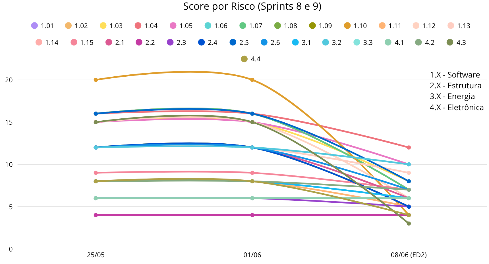
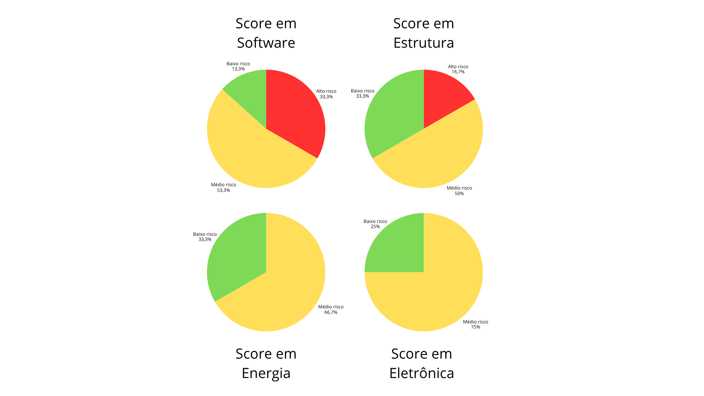

# Gerenciamento de Riscos

## 1. Introdução

Este documento apresenta o levantamento e o gerenciamento dos principais riscos identificados no desenvolvimento do projeto do Micromouse na disciplina de Projeto Integrador de Engenharia, na UnB/FCTE (2026.1), pelo Grupo 02, orientado pelo docente Hilmer Rodrigues Neri. O trabalho envolve a construção de um robô capaz de resolver labirintos, seguindo uma abordagem scrum.

Por possuir restrições fortes de espaço, integração entre subsistemas e prazo de entrega, a gestão de riscos se torna parte central do planejamento. Assim, o objetivo deste documento é registrar os pontos críticos percebidos pela equipe e propor formas práticas de mitigação, de modo a reduzir impactos sobre prazo, qualidade, integração e funcionamento final do micromouse.

## 2. Metodologia

A identificação dos riscos atual (sprint 8) foi realizada a partir das discussões internas da equipe, feitas em grupo por WhatsApp e complementadas pela reunião de sprint planning. A partir dessas conversas, foram consolidados os principais pontos de atenção de cada núcleo, considerando as decisões já tomadas para o projeto, que direcionaram a medição e estimativa dos dados apresentados aqui.

A análise foi conduzida de forma qualitativa, observando probabilidade de ocorrência, impacto sobre o projeto e relação de dependência entre os núcleos, definindo uma descrição do problema e uma estratégia de mitigação compatível com a equipe e com o estágio atual do desenvolvimento. Também foi conduzida uma análise quantitativa, que utilizou três métricas (Probabilidade, Impacto e Score) para avaliar os riscos selecionados em cada núcleo. Essas métricas, apresentadas abaixo, foram definidas com base nas discussões do grupo e em modelos de gerenciamento de riscos de repositórios da organização [fga-eps-mds](https://github.com/fga-eps-mds) no *GitHub*, conforme orientação docente.

### 2.1 Probabilidade (P)

Possibilidade de o evento ocorrer, ou de a situação trazer um impacto negativo para o desenvolvimento.

| 1 | 2 | 3 | 4 | 5 |
| :---: | :---: | :---: | :---: | :---: |
| **Muito baixo** | **Baixo** | **Regular** | **Alto** | **Muito alto** |

### 2.2 Impacto (I)

O quão relevante será o impacto daquele evento, se ocorrer, para o desenvolvimento do projeto.

| 1 | 2 | 3 | 4 | 5 |
| :---: | :---: | :---: | :---: | :---: |
| **Muito baixo** | **Baixo** | **Regular** | **Alto** | **Muito alto** |

### 2.3 Score (S)

É o produto das duas métricas anteriores (Probabilidade X Impacto). Define o nível de atenção que a equipe deve ter na mitigação/prevenção daquele risco, e a ação para isso.

| Faixa | Classificação do risco | Ação esperada |
| :---: | :---: | :---: |
| 1 - 6 | Baixo | Monitorar |
| 7 - 15 | Médio | Mitigação em pequena escala |
| 16 - 25 | Alto | Ação de mitigação imediata |

## 3. Riscos Identificados

A tabela a seguir resume os riscos identificados pela equipe, junto com o levantamento de métricas (*"Probabilidade" (P)*, *"Impacto" (I)* e *"Score" (S)*), ordenada por *S*.

<i>Tabela 1: Riscos identificados e Score</i>

| ID | Riscos Identificados | Área | P | I | S |
| :-: | :- | :-: | :-: | :-: | :-: |
| [1.10](#_5110-risco-de-perda-de-dados-de-telemetria) | Risco de perda de dados de telemetria | `Software` | 4 | 5 | 20 |
| [1.01](#_5101-acúmulo-de-atividades-entre-sprints) | Acúmulo de atividades entre sprints | `Software` | 4 | 4 | 16 |
| [1.02](#_5102-sobrecarga-de-outras-disciplinas) | Sobrecarga de outras disciplinas | `Software` | 4 | 4 | 16 |
| [1.04](#_5104-peso-da-ed2-na-frente-de-software) | Peso da ED2 na frente de software | `Software` | 4 | 4 | 16 |
| [1.07](#_5107-dependência-da-integração-com-a-eletrônica) | Dependência da integração com a eletrônica | `Software` | 4 | 4 | 16 |
| [2.5](#_525-uso-da-impressora-3d) | Uso da Impressora 3D | `Estrutura` | 4 | 4 | 16 |
| [1.03](#_5103-conflitos-de-cronograma) | Conflitos de cronograma | `Software` | 3 | 5 | 15 |
| [1.05](#_5105-baixa-previsibilidade-na-entrega-de-issues) | Baixa previsão na entrega de issues | `Software` | 3 | 5 | 15 |
| [1.12](#_5112-risco-de-atraso-na-integração-software--hardware) | Risco de atraso na integração software + hardware | `Software` | 3 | 5 | 15 |
| [4.3](#_543-logística-para-fabricação-e-envio-da-pcb) | Logística para fabricação e envio da PCB | `Eletrônica` | 3 | 5 | 15 |
| [1.09](#_5109-risco-na-comunicação-do-micromouse-para-o-sistema-web) | Risco na comunicação do Micromouse para Sistema Web | `Software` | 3 | 4 | 12 |
| [1.13](#_5113-débito-técnico) | Débito técnico | `Software` | 3 | 4 | 12 |
| [2.1](#_521-dimensionamento-do-chassi) | Dimensionamento do chassi | `Estrutura` | 3 | 4 | 12 |
| [2.4](#_524-adequação-do-suporte-para-pcb) | Adequação do suporte para PCB | `Estrutura` | 4 | 3 | 12 |
| [2.6](#_526-tempo-curto-para-ajustes-antes-da-entrega-2) | Tempo curto para ajustes antes da entrega 2 | `Estrutura` | 3 | 4 | 12 |
| [3.2](#_532-soldagem-da-bateria) | Soldagem da bateria | `Energia` | 3 | 4 | 12 |
| [1.15](#_5115-dependência-de-participação-contínua-dos-responsáveis) | Dependência de participação contínua dos responsáveis | `Software` | 3 | 3 | 9 |
| [1.06](#_5106-dependências-técnicas-entre-atividades) | Dependências técnicas entre atividades | `Software` | 2 | 4 | 8 |
| [1.11](#_5111-risco-de-inconsistência-na-persistência) | Risco de inconsistência na persistência | `Software` | 2 | 4 | 8 |
| [3.1](#_531-cálculo-de-parâmetros-da-bateria) | Cálculo de parâmetros da bateria | `Energia` | 2 | 4 | 8 |
| [4.2](#_542-integração-de-telemetria) | Integração de telemetria | `Eletrônica` | 2 | 4 | 8 |
| [4.4](#_544-confiabilidade-física) | Confiabilidade física | `Eletrônica` | 2 | 4 | 8 |
| [1.08](#_5108-incerteza-no-fluxo-operacional-da-corrida) | Incerteza no fluxo operacional da corrida | `Software` | 2 | 3 | 6 |
| [1.14](#_5114-documentação-desalinhada-com-a-implementação) | Documentação desalinhada com a implementação | `Software` | 3 | 2 | 6 |
| [2.3](#_523-adequação-do-suporte-dos-sensores) | Adequação do suporte dos sensores | `Estrutura` | 2 | 3 | 6 |
| [3.3](#_533-adequação-do-suporte-da-bateria) | Adequação do suporte da bateria | `Energia` | 3 | 2 | 6 |
| [4.1](#_541-densidade-de-componentes) | Densidade de componentes | `Eletrônica` | 2 | 3 | 6 |
| [2.2](#_522-acoplamento-das-rodas) | Acoplamento das rodas | `Estrutura` | 2 | 2 | 4 |

<i>Fonte: Elaboração própria pelo grupo.</i>

 

## 4. Esboço do Plano de Gerenciamento de Riscos

A *Figura 1* apresenta um esboço do Plano de Gerenciamento de Riscos da equipe 2 para as sprints 8 e 9 do período de desenvolvimento do produto, que se localizam anteriormente ao ponto de controle 2 (ED2).

<i>Figura 1: Plano de Gerenciamento de Riscos</i>

<i>Fonte: Elaboração própria pelo grupo.</i>

O plano de gerenciamento de riscos, elaborado com base nos valores de *Score* calculados pela equipe, apresenta uma queda estimada dos valores dessa métrica após aplicação das ações de mitigação elaboradas pelo time. Essa metodologia apresenta, visualmente, o direcionamento necessário do time para os riscos com maior nível de **Probabilidade X Impacto**, a fim de mitigar os mesmos. Perceba também que os problemas com nível *baixo* e *médio* possuem pouca ou nenhuma variação, uma vez que é esperado que permaneçam “em observação” até que os de alto risco sejam mitigados. Assim, com esse plano de duas sprints, o time possui uma meta de redução das probabilidades e impactos desses riscos que deve ser seguida até a data do segundo ponto de controle.

 

## 5. Descrição e Mitigação dos riscos

### 5.1. Núcleo de Software

#### 5.1.01 Acúmulo de atividades entre sprints

**`Descrição:`**
Tarefas pendentes de sprints anteriores estão se acumulando e aumentando a carga da sprint atual.

**`Mitigação:`**
A equipe deve priorizar o fechamento do que já foi iniciado e dividir issues maiores em partes menores, evitando acúmulo silencioso.

#### 5.1.02 Sobrecarga de outras disciplinas

**`Descrição:`**
A baixa disponibilidade dos integrantes, por causa de outras disciplinas, reduz o ritmo e a comunicação da equipe.

**`Mitigação:`**
As tarefas devem ser bem distribuídas e com pouca dependência entre pessoas, para que o andamento não fique concentrado em poucos membros.

#### 5.1.03 Conflitos de cronograma

**`Descrição:`**
Choques entre aulas, avaliações e outras demandas dificultam o cumprimento dos prazos planejados.

**`Mitigação:`**
O cronograma deve ter margem de segurança e ser revisado com frequência para permitir redistribuição rápida das atividades.

#### 5.1.04 Peso da ED2 na frente de software

**`Descrição:`**
A documentação exigida pela ED2 compete diretamente com o tempo disponível para implementar o sistema.

**`Mitigação:`**
Documentação e desenvolvimento devem caminhar juntos, com responsáveis definidos para atualizar os materiais conforme as entregas avançam.

#### 5.1.05 Baixa previsibilidade na entrega de issues

**`Descrição:`**
Algumas tarefas estão levando mais tempo que o previsto, dificultando o acompanhamento real do projeto.

**`Mitigação:`**
As issues devem ser melhor estimadas e, quando necessário, quebradas em etapas menores com revisão periódica de andamento.

#### 5.1.06 Dependências técnicas entre atividades

**`Descrição:`**
Várias funcionalidades dependem de definições anteriores, como telemetria, banco de dados e validação dos pacotes.

**`Mitigação:`**
As bases do sistema devem ser definidas cedo, e versões simples podem ser usadas para validar a arquitetura antes da solução final.

#### 5.1.07 Dependência da integração com a eletrônica

**`Descrição:`**
Mudanças no protocolo de comunicação afetam backend, banco e interface web.

**`Mitigação:`**
A equipe deve manter comunicação constante entre os núcleos e documentar bem o protocolo, com testes simulados antes da integração real.

#### 5.1.08 Incerteza no fluxo operacional da corrida

**`Descrição:`**
Ainda há indefinição sobre a transição entre mapeamento, rota otimizada e finalização da corrida.

**`Mitigação:`**
Um fluxo mínimo deve ser fechado o quanto antes, para que backend e interface possam avançar com regras estáveis.

#### 5.1.09 Risco na comunicação do Micromouse para o Sistema Web

**`Descrição:`**
O sistema depende do envio estável de pacotes via Wi-Fi/HTTP POST com JSON.

**`Mitigação:`**
A comunicação deve ser validada gradualmente, com pacotes simples no início e tratamento claro de erros no servidor.

#### 5.1.10 Risco de perda de dados de telemetria

**`Descrição:`**
Falhas de rede, de backend ou encerramento inesperado podem comprometer o histórico da corrida.

**`Mitigação:`**
Os dados devem ser salvos de forma incremental, com confirmação de recebimento e mecanismos de reenvio.

#### 5.1.11 Risco de inconsistência na persistência

**`Descrição:`**
Mudanças nos campos enviados ou falta de identificador de corrida podem gerar registros incorretos no banco.

**`Mitigação:`**
A API e o banco devem usar identificador único por corrida e validar os pacotes antes do armazenamento.

#### 5.1.12 Risco de atraso na integração software + hardware

**`Descrição:`**
Se a validação real ficar para o fim, haverá pouco tempo para corrigir incompatibilidades.

**`Mitigação:`**
A integração deve começar assim que possível, mesmo em bancada, para antecipar problemas de comunicação e leitura.

#### 5.1.13 Débito técnico

**`Descrição:`**
A pressão por prazo pode levar a soluções provisórias e pouca revisão, aumentando a chance de bugs.

**`Mitigação:`**
A equipe deve reservar tempo para revisão técnica e registrar claramente quando uma solução for temporária.

#### 5.1.14 Documentação desalinhada com a implementação

**`Descrição:`**
Mudanças no sistema podem não ser refletidas na documentação.

**`Mitigação:`**
Os documentos devem ser atualizados continuamente junto com a implementação, com responsáveis definidos.

#### 5.1.15 Dependência de participação contínua dos responsáveis

**`Descrição:`**
Baixa participação em tarefas específicas pode travar o andamento de outras frentes.

**`Mitigação:`**
As tarefas devem ser conhecidas por mais de um integrante, para facilitar redistribuição em caso de ausência.

### 5.2. Núcleo de Estruturas

#### 5.2.1 Dimensionamento do chassi

**`Descrição:`**
O chassi menor pode gerar incompatibilidade com os componentes internos.

**`Mitigação:`**
O projeto deve ser validado com os demais núcleos, considerando espaço real, encaixes e passagem de cabos.

#### 5.2.2 Acoplamento das rodas

**`Descrição:`**
O acoplamento direto das rodas ao motor pode gerar desalinhamento e imprecisão nos movimentos.

**`Mitigação:`**
Devem ser feitos testes de montagem para verificar alinhamento, atrito e estabilidade do conjunto.

#### 5.2.3 Adequação do suporte dos sensores

**`Descrição:`**
Há risco de erro no posicionamento dos sensores e no desenho do suporte, afetando a leitura.

**`Mitigação:`**
O suporte deve ser testado com medições em bancada para garantir altura, espaçamento e fixação corretos.

#### 5.2.4 Adequação do suporte para PCB

**`Descrição:`**
O suporte das placas precisa manter espaçamento sem prejudicar conexões nem aumentar demais a altura.

**`Mitigação:`**
O encaixe deve ser validado antes da impressão final, considerando cabos, conectores e espaço interno.

#### 5.2.5 Uso da impressora 3D

**`Descrição:`**
A fabricação das peças depende de impressora 3D com boa precisão, o que pode gerar atrasos.

**`Mitigação:`**
A impressão deve ser planejada com antecedência, e peças de teste podem ajudar a validar tolerâncias.

#### 5.2.6 Tempo curto para ajustes antes da entrega 2

**`Descrição:`**
O prazo reduzido limita correções e aumenta o impacto de erros na montagem final.

**`Mitigação:`**
Os testes mais críticos devem ser antecipados, deixando para essa fase apenas ajustes pontuais.

### 5.3. Núcleo de Energia

#### 5.3.1 Cálculo de parâmetros da bateria

**`Descrição:`**
O dimensionamento da bateria precisa atender à demanda do sistema sem comprometer a autonomia.

**`Mitigação:`**
Os consumos devem ser revisados e, sempre que possível, confirmados com medições práticas.

#### 5.3.2 Soldagem da bateria

**`Descrição:`**
A soldagem pode causar danos aos componentes ou riscos aos integrantes se for feita sem cuidado.

**`Mitigação:`**
O processo deve seguir boas práticas de segurança, com atenção à polaridade e à temperatura do ferro.

#### 5.3.3 Adequação do suporte da bateria

**`Descrição:`**
Se a bateria ficar distante da PCB, a conexão pode se tornar difícil ou instável.

**`Mitigação:`**
O suporte deve ser projetado junto com a distribuição interna do robô, validando as distâncias reais.

### 5.4. Núcleo de Eletrônica

#### 5.4.1 Densidade de componentes

**`Descrição:`**
O espaço reduzido exige uma PCB compacta, aumentando o risco de erro no layout.

**`Mitigação:`**
O roteamento e a posição dos componentes devem ser revisados com atenção antes da fabricação.

#### 5.4.2 Integração de telemetria

**`Descrição:`**
A telemetria com interface web precisa funcionar sem atrapalhar o desempenho do robô.

**`Mitigação:`**
A solução deve ser leve e testada gradualmente para não interferir nos algoritmos principais.

#### 5.4.3 Logística para fabricação e envio da PCB

**`Descrição:`**
O prazo de fabricação da placa é um dos principais gargalos do projeto.

**`Mitigação:`**
A PCB deve ser revisada com cuidado antes do envio, para evitar retrabalho e perda de prazo.

#### 5.4.4 Confiabilidade física

**`Descrição:`**
As vibrações do robô podem afetar soldas e conectores se a placa não estiver bem fixada.

**`Mitigação:`**
A PCB deve ser presa de forma firme e testada para suportar o movimento do conjunto.

 

## 6. Classificação de risco por núcleo

A *Figura 2* exibe uma contagem visual da classificação dos riscos obtida pelo time.

<i>Figura 2: Análise da classificação de riscos por núcleo</i>

<i>Fonte: Elaboração própria pelo grupo.</i>

Observe que, na etapa atual do projeto (Sprints 8 e 9), o levantamento de riscos aponta para maior concentração de problemas de **alto risco** dentro das frentes de Estrutura e de Software. Esse fenômeno pode, de acordo com uma análise do time, indicar que esses núcleos são pontos de interesse para o gerenciamento de riscos. Isso significa, na prática, que o grupo deve direcionar seus esforços na mitigação de riscos envolvendo essas frentes.

Além disso, também é perceptível a semelhança dos gráficos para Energia e Eletrônica. Em ambos os casos, isso pode indicar que os membros dos núcleos em questão conseguiram controlar seus riscos sem que algum deles se sobressaísse como uma preocupação para o resto do grupo. No tópico seguinte, será apresentado um esboço do plano de gerenciamento de riscos para o momento atual do projeto desenvolvido pelo grupo, levando em conta essa análise realizada pelo grupo sobre as métricas obtidas.

## 7. Considerações finais

A análise dos riscos mostra que o sucesso do projeto depende tanto da execução técnica quanto da coordenação entre os núcleos. Como o micromouse possui um espaço físico reduzido, integração complexa e prazo acadêmico limitado, os riscos não devem ser tratados apenas como problemas pontuais, mas como elementos previstos do desenvolvimento. Com acompanhamento contínuo, comunicação entre as áreas e atualizações frequentes do planejamento, além do direcionamento apresentado pelo plano de gerenciamento de riscos, a equipe aumenta a chance de seguir seu planejamento a cada entrega.  

## 8. Tabela de Versionamento

| Versão | Data | Autor | Descrição | Revisor |
| :-: | :-: | :-: | :-: | :-: |
| 1.0 | 05/06/2026 | [Eduardo de Pina](https://github.com/eduardodpms) | Conversão do documento para markdown | [Geovana Almeida](https://github.com/geovanaams) |
