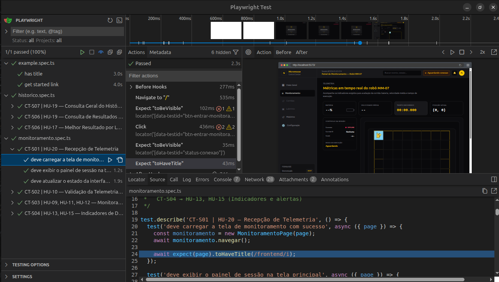
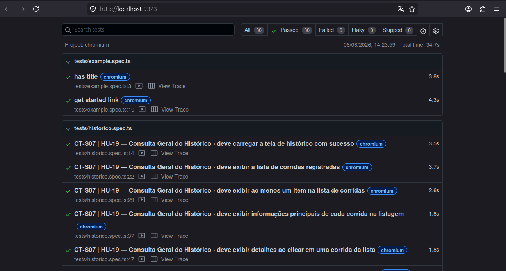
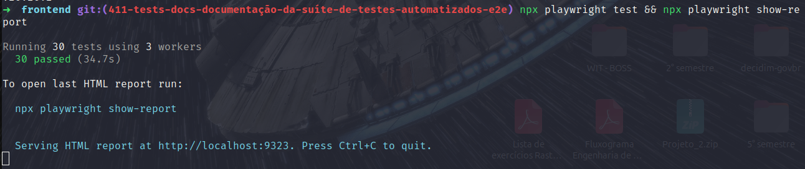
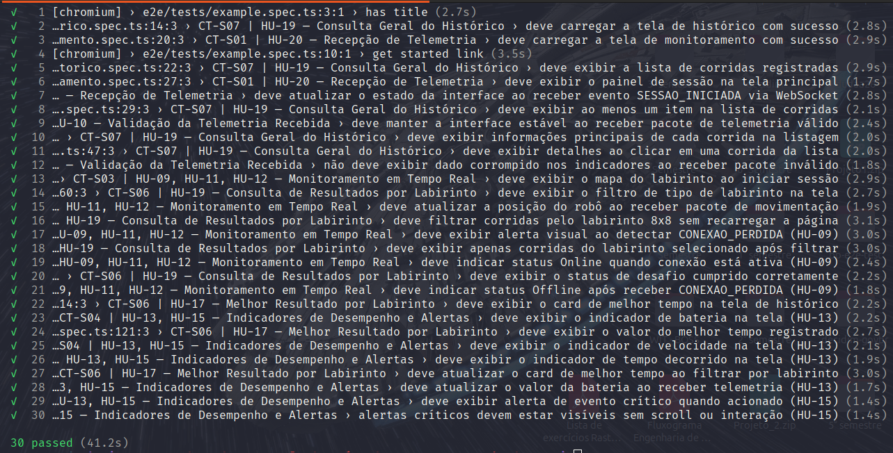

# 7.5 — Testes de Software

> Documentação dos testes unitários, de integração e E2E do Sistema Web do Micromouse.

---

## 1. Ferramentas Utilizadas

### Backend (Python)

| Ferramenta | Versão | Propósito |
|---|---|---|
| `pytest` | 9.0.3 | Framework de testes unitários e de integração |
| `pytest-asyncio` | 1.3.0 | Suporte a testes assíncronos (`async/await`) |
| `pytest-cov` | 7.1.0 | Relatório de cobertura de código |
| `FastAPI TestClient` | (via fastapi 0.136.1) | Testes de endpoints HTTP e WebSocket |
| PostgreSQL (Docker) | 16 | Banco de dados de teste isolado (`db_test`) |

### Frontend (TypeScript/React)

| Ferramenta | Versão | Propósito |
|---|---|---|
| `Vitest` | 4.1.7 | Framework de testes (compatível com Vite) |
| `@testing-library/react` | 16.3.2 | Renderização e interação com componentes React |
| `@testing-library/jest-dom` | 6.9.1 | Matchers DOM (`.toBeInTheDocument()`, etc.) |
| `@testing-library/user-event` | 14.6.1 | Simulação de eventos de usuário |
| `@vitest/coverage-v8` | 4.1.7 | Cobertura de código via V8 |
| `jsdom` | 29.1.1 | Ambiente de DOM simulado para testes |

### E2E — Sistema (TypeScript)

| Ferramenta | Versão | Propósito |
|---|---|---|
| `Playwright` | 1.52.0 | Framework de testes E2E em navegador real |
| `@playwright/test` | 1.52.0 | Runner de testes, asserções e fixtures |
| Chromium | (bundled) | Navegador utilizado na execução dos testes |

> Os testes E2E executam sobre a aplicação web em execução local (`http://localhost:5173`). A comunicação WebSocket é simulada via evento customizado `ws-test-message`, permitindo testar fluxos de telemetria sem dependência do hardware físico ou do backend ativo.

---

## 2. Suítes de Testes do Backend

### 2.1 Testes Unitários

#### `test_telemetria.py` — Lógica dos Indicadores de Desempenho

| Classe | Casos | Descrição |
|---|---|---|
| `TestIdentificarTipoPacote` | 10 | Identifica tipo dos pacotes (0–5, inválidos, None, sem campo `tipo`) |
| `TestValidarPacote` | 15 | Valida campos obrigatórios, ranges de bateria, timestamp regressivo, bitmask `w`, dimensão |
| `TestCalcularVelocidadeSegmento` | 6 | Velocidade entre dois pontos, delta_t ≤ 0, diagonal, sem deslocamento |
| `TestCriarEstadoInicial` | 2 | Estado inicial com status `AGUARDANDO` e campos zerados |
| `TestAtualizarIndicadores` | 15 | Processamento de pacotes: atualiza bateria, velocidade, tempo, alertas; imutabilidade |
| `TestCenariosSimulados` | 6 | Corrida completa, bateria crítica, parada inesperada, pacotes inválidos |

**Módulos cobertos:** `app/services/telemetria.py`, `app/schemas/telemetria.py`  
**HUs relacionadas:** US-05 (Indicadores de Desempenho), US-07 (Alertas Funcionais)

#### `test_connection_monitor.py` — Monitoramento de Conexão

| Classe | Casos | Descrição |
|---|---|---|
| `TestConnectionState` | 5 | Estado inicial online, touch, timeout com valores customizados |
| `TestRegistrarPacote` | 3 | Nova corrida online, atualização de last_seen, restauração após offline |
| `TestCheckTimeouts` | 3 | Timeout após 3s, não-timeout recente, offline não re-notifica |
| `TestRemoverCorrida` | 2 | Remoção limpa estado, remoção inexistente não falha |
| `TestNotificacaoWebSocket` | 2 | Formato correto para online e offline |
| `TestFluxoCompleto` | 2 | Ciclo online→offline→online, múltiplas corridas independentes |

**Módulos cobertos:** `app/services/connection_monitor.py`  
**HU relacionada:** US-09 (Monitoramento de Conexão)

#### `test_novos_pacotes.py` — Heartbeat e Alerta de Temperatura

| Classe | Casos | Descrição |
|---|---|---|
| `TestIdentificarTiposNovos` | 2 | Identificação de tipo 4 (Heartbeat) e tipo 5 (AlertaTemperatura) |
| `TestValidarHeartbeat` | 5 | Validação de campos do Heartbeat: bateria obrigatória, range, tipo |
| `TestValidarAlertaTemperatura` | 4 | Validação de `temp_c`: obrigatório, numérico, aceita int |
| `TestProcessarHeartbeat` | 5 | Atualiza bateria/timestamp, não muda status, alerta bateria crítica |
| `TestProcessarAlertaTemperatura` | 5 | Aborta corrida, registra log, seta flag, fixa tempo, não aborta se já encerrada |

**Módulos cobertos:** `app/services/telemetria.py` (processamento de pacotes 4 e 5)  
**HU relacionada:** US-10 (Heartbeat), US-11 (Alerta de Temperatura)

#### `test_alertas_funcionais.py` — Persistência de Alertas

| Função | Casos | Descrição |
|---|---|---|
| `test_alerta_bateria_critica_e_persistido` | 1 | Alerta de bateria crítica persiste como Evento no banco |
| `test_alerta_parada_inesperada_e_persistido` | 1 | Alerta de parada inesperada persiste como Evento |
| `test_alerta_de_parada_nao_dispara_fora_de_corrida_ativa` | 1 | Não emite alerta quando corrida não está EM_ANDAMENTO |

**Módulos cobertos:** `app/routers/telemetria.py` (função `_persistir_novos_alertas`)  
**HU relacionada:** US-07 (Alertas Funcionais)

### 2.2 Testes de Integração

#### `test_persistencia.py` — Persistência no Banco de Dados

| Classe | Casos | Descrição |
|---|---|---|
| `TestIniciarCorrida` | 4 | Cria labirinto e corrida, tipos 4×4 e 16×16, data de início |
| `TestSalvarCorrida` | 5 | Salva campos básicos, resultado de falha, percurso via células, validação de tempo negativo, corrida inexistente |
| `TestPersistenciaFluxoTelemetria` | 9 | Fluxo completo HTTP: pacote inicial cria corrida, movimentação registra percurso, rota otimizada, reutiliza célula, pacote final salva tempo/resultado/velocidade, pacote inválido não persiste |

**Módulos cobertos:** `app/services/registro.py`, `app/routers/telemetria.py`, `app/models/*`  
**HU relacionada:** US-06 (Persistência de Dados), US-12 (Consulta de Corridas)

#### `test_telemetria_router.py` — Endpoints HTTP

| Função | Casos | Descrição |
|---|---|---|
| `test_fluxo_telemetria_completo_sucesso` | 1 | Fluxo completo: inicial → movimentação → final |
| `test_falhas_validacao_barreira` | 8 | Parametrizado: falta tipo, tipo desconhecido, timestamp negativo, dimensão inválida, bateria fora do limite, sucesso não booleano, v_med negativo, w fora do range |
| `test_falha_timestamp_regressivo_isolado` | 1 | Timestamp regressivo retorna 422 |
| `test_pacote_nao_inicial_sem_sessao_ativa` | 1 | Pacote não-inicial sem sessão retorna 409 |

**Módulos cobertos:** `app/routers/telemetria.py` (endpoint `/api/telemetria/pacote`)  
**HU relacionada:** US-04 (Recepção de Telemetria)

#### `test_websocket.py` — Comunicação WebSocket

| Função | Casos | Descrição |
|---|---|---|
| `test_websocket_connection` | 1 | Conecta ao WebSocket e recebe HANDSHAKE |
| `test_telemetry_post_endpoint` | 1 | POST de pacote retorna 201 com alerta de bateria crítica |
| `test_websocket_message_delivery` | 1 | Pacote HTTP é entregue via WebSocket ao dashboard |

**Módulos cobertos:** `app/routers/telemetria.py` (WebSocket), `app/services/websocket_manager.py`  
**HU relacionada:** US-04 (Recepção de Telemetria), US-05 (Dashboard em Tempo Real)

#### `test_novos_pacotes.py` — Integração HTTP (Heartbeat e Temperatura)

| Classe | Casos | Descrição |
|---|---|---|
| `TestHeartbeatRouter` | 4 | Heartbeat retorna 201, sem sessão retorna 409, atualiza bateria, persiste alerta |
| `TestAlertaTemperaturaRouter` | 6 | Alerta retorna 201, encerra sessão, sem sessão retorna 409, marca corrida como abortada, persiste evento, sem temp_c retorna 422 |

**Módulos cobertos:** `app/routers/telemetria.py`  
**HU relacionada:** US-10 (Heartbeat), US-11 (Alerta de Temperatura)

#### `test_melhor_resultado.py` — Endpoint de Melhor Resultado

| Classe | Casos | Descrição |
|---|---|---|
| `TestMelhorResultadoEndpoint` | 7 | Retorna menor tempo, null sem desafio cumprido, corrida abortada excluída, filtro por tipo, campos de rastreabilidade, tipo sem corridas, tipo inválido 422 |

**Módulos cobertos:** `app/routers/labirinto.py`  
**HU relacionada:** US-17 (Melhor Resultado / Recorde)

#### `test_integracao_firmware.py` — Integração Firmware ↔ Backend

| Classe/Função | Casos | Descrição |
|---|---|---|
| `test_cenario_corridas_sequenciais` | 1 | Simula cenário realista com múltiplas corridas no mesmo banco (sucesso, falha, interrupções). |
| `TestContratoTelemetriaMd` | 44 | Valida estritamente os campos e restrições dos pacotes de 0 a 5 com base no documento `telemetria.md`. |
| `TestCenariosAdversos` | 6 | Verifica a resiliência a timestamps regressivos/negativos, baterias inválidas e pacotes sem sessão ativa. |
| `TestBroadcastWebSocket` | 4 | Garante o envio correto dos eventos (`SESSAO_INICIADA`, `MOVIMENTACAO`, `HEARTBEAT`, etc.) via WebSocket. |
| `TestDimensoesLabirinto` | 3 | Valida se as dimensões permitidas (4, 8, 16) mapeiam corretamente para os tipos de labirinto no banco. |

**Módulos cobertos:** Integração ponta-a-ponta, validando contrato (`telemetria.md`), roteamento, persistência e websocket.
**HU relacionada:** HU-08, HU-09, HU-10, HU-11, HU-14, HU-15, HU-16, HU-19, HU-20

---

## 3. Suítes de Testes do Frontend

### 3.1 Testes Unitários

#### `DashboardIndicadores.test.tsx` — Cards de Indicadores

| Suíte (CT) | Casos | Descrição |
|---|---|---|
| CT01 — Estado Vazio | 10 | Renderiza labels (Bateria, Controle da Sessão), exibe "--" para valores ausentes, modo "Aguardando", status Offline, sem alertas |
| CT03 — Bateria Crítica | 3 | Exibe banner de alerta, valor real da bateria, abre modal de alerta crítico |
| CT04 — Bateria Normal | 5 | Exibe valor normal, sem banner/modal de alerta, status Online, modo Mapeamento |

**Componente coberto:** `DashboardIndicadores.tsx` (TopIndicators, ControlPanel, TelemetryAlerts)  
**HU relacionada:** US-05 (Indicadores de Desempenho), US-07 (Alertas Visuais)

#### `CardMelhorTempo.test.tsx` — Card de Melhor Resultado

| Suíte (CT) | Casos | Descrição |
|---|---|---|
| CT-CMT-01 — Carregamento | 3 | Exibe "--" durante loading, título "Melhor Resultado" |
| CT-CMT-02 — Estado Vazio | 5 | "Nenhum desafio concluído ainda", sem badge de recorde |
| CT-CMT-03 — Com Recorde | 6 | Exibe id_corrida, tempo formatado, data, badge "Recorde registrado", labels |
| CT-CMT-04 — Estado de Erro | 3 | Exibe mensagem de erro, sem título |

**Componente coberto:** `CardMelhorTempo.tsx`  
**HU relacionada:** US-17 (Melhor Resultado / Recorde)

#### `formatarTempo.test.ts` — Formatação de Tempo

| Suíte (CT) | Casos | Descrição |
|---|---|---|
| CT02 — formatarTempo | 14 | undefined/null/NaN/negativo → "00:00.000"; formatação de segundos, minutos, padding; acima de 60 min |

**Função coberta:** `formatarTempo()` (lógica de apresentação)  
**HU relacionada:** US-05 (Indicadores de Desempenho)

#### `normalizePathToOrthogonal.test.ts` — Normalização de Caminho

| Suíte | Casos | Descrição |
|---|---|---|
| normalizePathToOrthogonal | 11 | Array vazio, ponto único, trajeto ortogonal, diagonal simples/grande, múltiplas diagonais, mix, direção inversa, pontos duplicados |

**Função coberta:** `normalizePathToOrthogonal()` em `mazeUtils.ts`  
**HU relacionada:** HU-12 (Exibição do Trajeto)

#### `mazeUtils.test.ts` — Lógica do Labirinto

| Suíte | Casos | Descrição |
|---|---|---|
| CT-MU-01 — Construção | 6 | Criação de labirinto, inicialização de paredes, verificação de fora dos limites. |
| CT-MU-02 — Movimento | 7 | Normalização de direções, movimentação ortogonal, verificação de paredes entre células. |
| CT-MU-03 — Objetivo | 6 | Verificação de área objetivo de 2x2 sem paredes internas. |

**Funções cobertas:** Toda a lógica pura do labirinto (`mazeUtils.ts`).  
**HU relacionada:** HU-12 (Exibição do Trajeto)

#### `CorridaTable.test.tsx` — Listagem de Corridas

| Suíte | Casos | Descrição |
|---|---|---|
| CT-CT-01 — Renderização | 4 | Exibe estados de loading, tabela vazia, formatação de status e colunas de dados. |

**Componente coberto:** `CorridaTable.tsx`  
**HU relacionada:** HU-19 (Consulta Geral)

#### `CorridaDetailPanel.test.tsx` — Painel de Detalhes

| Suíte | Casos | Descrição |
|---|---|---|
| CT-CDP-01 — Renderização | 4 | Estado sem seleção, carregando, renderização de percurso e informações formatadas. |

**Componente coberto:** `CorridaDetailPanel.tsx`  
**HU relacionada:** HU-21 (Consulta Individual)

#### `Session.test.tsx` — Controle de Sessão

| Suíte | Casos | Descrição |
|---|---|---|
| CT-SESS-01 — Estados | 5 | Modo conectando, exibição de erro, sessão em andamento, navegação de telas. |

**Componente coberto:** `Session.tsx`  
**HU relacionada:** HU-11 (Início de Sessão)

#### `MonitoringLayout.test.tsx` — Layout de Monitoramento

| Suíte | Casos | Descrição |
|---|---|---|
| CT-ML-01 — Navegação | 5 | Colapso de menu, navegação entre abas de telemetria, labirinto e corridas, status de conexão. |

**Componente coberto:** `MonitoringLayout.tsx`  
**HU relacionada:** HU-09 (Monitoramento)

### 3.2 Testes de Integração

#### `DashboardIndicadores.integration.test.tsx` — Atualização em Tempo Real

| Suíte (CT) | Casos | Descrição |
|---|---|---|
| CT05 — Atualização em Tempo Real | 4 | Atualiza bateria/velocidade/tempo, modo "Mapeamento", atualiza tempo com segundo pacote, formatação de velocidade |
| CT06 — Queda de Telemetria | 4 | Alerta após 3s sem pacote, não exibe se pacote chega antes, mantém última bateria, não exibe quando aguardando |
| CT07 — Encerramento de Corrida | 6 | Tempo final fixado, modo "Finalizado", bateria final, sem alerta após conclusão |

**Componentes cobertos:** `DashboardIndicadores.tsx` (integração com hook `useTelemetria` mockado)  
**HU relacionada:** US-05 (Dashboard em Tempo Real), US-09 (Monitoramento de Conexão)

#### `CardMelhorTempo.integration.test.tsx` — Hook + Service

| Suíte (CT) | Casos | Descrição |
|---|---|---|
| CT-CMT-INT-01 — Estado Vazio | 2 | Service retorna null → "Nenhum desafio", chama `fetchMelhorTempo` com tipo correto |
| CT-CMT-INT-02 — Com Recorde | 4 | Exibe tempo/id/data formatados após resolução, loading antes → recorde depois |
| CT-CMT-INT-03 — Refetch | 3 | Atualiza quando tipo muda, novo recorde via props, loading durante refetch |
| CT-CMT-INT-04 — Erro | 1 | Exibe mensagem de erro quando service lança exceção |

**Componentes cobertos:** `CardMelhorTempo.tsx` + hook `useMelhorTempo` + service `corrida.ts`  
**HU relacionada:** HU-17 (Melhor Resultado)

#### `CorridaDashboard.integration.test.tsx` — Dashboard de Corridas

| Suíte (CT) | Casos | Descrição |
|---|---|---|
| CT-CD-INT-01 — Navegação | 2 | Interligação entre clicar na tabela e ver o detalhe no painel lateral, tratamento de erros de API. |

**Componentes cobertos:** `CorridaDashboard.tsx`, composição com tabela e painel.  
**HU relacionada:** HU-18 (Histórico do Labirinto), HU-19 (Consulta Geral)

#### `useCorrida.integration.test.tsx` — Integração de Hook e API

| Suíte (CT) | Casos | Descrição |
|---|---|---|
| CT-UC-INT-01 — Fetch | 6 | Mock da API, tratamento de carregamento, erros, seleção de corrida com refetch de detalhes. |

**Componentes cobertos:** Hook `useCorrida.ts` e serviço `corrida.ts`.  
**HU relacionada:** HU-18, HU-19, HU-21

---

## 4. Suítes de Testes E2E (Playwright)

Os testes E2E validam os fluxos de interação do usuário com a interface gráfica de ponta a ponta, executando sobre o navegador Chromium real. Por operarem sobre o navegador real, verificam aspectos não cobertos pelos testes com `jsdom`: renderização de componentes visuais, navegação entre *views*, eventos WebSocket em tempo real e visibilidade de alertas na *viewport*.

### `monitoramento.spec.ts` — Tela de Monitoramento (16 testes)

#### CT-S01 | HU-20 | Recepção de Telemetria (3 testes)

| Caso de Teste | Descrição |
|---|---|
| deve carregar a tela de monitoramento com sucesso | Verifica o carregamento da tela e o título da aplicação |
| deve exibir o painel de sessão na tela principal | Verifica que o painel de sessão está visível na tela raiz |
| deve atualizar o estado da interface ao receber evento SESSAO_INICIADA via WebSocket | Verifica que o mapa do labirinto aparece após o evento simulado |

#### CT-S02 | HU-10 | Validação da Telemetria Recebida (2 testes)

| Caso de Teste | Descrição |
|---|---|
| deve manter a interface estável ao receber pacote de telemetria válido | Confirma que mapa e indicadores permanecem visíveis com pacote válido |
| não deve exibir dado corrompido nos indicadores ao receber pacote inválido | Verifica que `undefined` e `null` não aparecem no DOM |

#### CT-S03 | HU-09, HU-11, HU-12 | Monitoramento em Tempo Real (5 testes)

| Caso de Teste | Descrição |
|---|---|
| deve exibir o mapa do labirinto ao iniciar sessão | Verifica visibilidade do mapa após SESSAO_INICIADA |
| deve atualizar a posição do robô ao receber pacote de movimentação | Verifica que a posição do robô é atualizada na interface |
| deve exibir alerta visual ao detectar CONEXAO_PERDIDA | Verifica o alerta de conexão perdida após evento simulado |
| deve indicar status Online quando conexão está ativa | Verifica o badge "Online" no header após SESSAO_INICIADA |
| deve indicar status Offline após receber CONEXAO_PERDIDA | Verifica o badge "Offline" após evento de conexão perdida |

#### CT-S04 | HU-13, HU-15 | Indicadores de Desempenho e Alertas (6 testes)

| Caso de Teste | Descrição |
|---|---|
| deve exibir o indicador de bateria na tela | Verifica visibilidade do card de bateria |
| deve exibir o indicador de velocidade na tela | Verifica visibilidade do card de velocidade |
| deve exibir o indicador de tempo decorrido na tela | Verifica visibilidade do card de tempo |
| deve atualizar o valor da bateria ao receber telemetria | Verifica que o valor de bateria é preenchido após telemetria |
| deve exibir alerta de evento crítico quando acionado | Verifica que o alerta crítico aparece após ALERTA_CRITICO |
| alertas críticos devem estar visíveis sem scroll ou interação | Verifica que o alerta está dentro da viewport sem scroll |

### `historico.spec.ts` — Tela de Histórico (11 testes)

#### CT-S07 | HU-19 | Consulta Geral do Histórico (5 testes)

| Caso de Teste | Descrição |
|---|---|
| deve carregar a tela de histórico com sucesso | Verifica o carregamento da tela de corridas |
| deve exibir a lista de corridas registradas | Verifica que a tabela de corridas está visível |
| deve exibir ao menos um item na lista de corridas | Verifica que há ao menos uma linha na listagem |
| deve exibir informações principais de cada corrida na listagem | Verifica que o primeiro item contém dados (data, status, dimensão) |
| deve exibir detalhes ao clicar em uma corrida da lista | Verifica que a lista permanece visível após clique |

#### CT-S06 | HU-19 | Consulta de Resultados por Labirinto (4 testes)

| Caso de Teste | Descrição |
|---|---|
| deve exibir o filtro de tipo de labirinto na tela | Verifica que os botões de filtro estão visíveis |
| deve filtrar corridas pelo labirinto 8x8 sem recarregar a página | Verifica que a URL não muda e a lista continua visível |
| deve exibir apenas corridas do labirinto selecionado após filtrar | Verifica o atributo `data-tipo-labirinto` nas linhas filtradas |
| deve exibir o status de desafio cumprido corretamente | Verifica o badge de status em cada corrida listada |

#### CT-S06 | HU-17 | Melhor Resultado por Labirinto (3 testes)

| Caso de Teste | Descrição |
|---|---|
| deve exibir o card de melhor tempo na tela de histórico | Verifica a visibilidade do card de melhor tempo |
| deve exibir o valor do melhor tempo registrado | Verifica que o valor do melhor tempo está preenchido |
| deve atualizar o card de melhor tempo ao filtrar por labirinto | Verifica que o card permanece visível após aplicar filtro |

---

## 5. Comandos de Execução

### Backend

```bash
# Executar todos os testes
cd src/backend
pytest

# Executar com cobertura detalhada
pytest --cov=app --cov-report=term-missing

# Executar suíte específica
pytest tests/test_telemetria.py -v
pytest tests/test_connection_monitor.py -v
pytest tests/test_persistencia.py -v

# Pré-requisito: banco de teste (subido automaticamente)
docker compose up -d db_test
```

### Frontend

```bash
# Executar todos os testes
cd src/frontend
npm run test

# Executar com cobertura
npm run test:coverage

# Executar em modo watch (desenvolvimento)
npm run test:watch

# Executar suíte específica
npx vitest run src/__tests__/unit/DashboardIndicadores.test.tsx
npx vitest run src/__tests__/integration/
```

### E2E — Playwright

```bash
# Requer Node.js >= 20 via nvm
cd src/frontend
nvm use 20

# Executar todos os 30 testes
npx playwright test

# Saída compacta no terminal
npx playwright test --reporter=line

# Abrir relatório HTML no navegador
npx playwright show-report

# Interface visual interativa (UI Mode)
npx playwright test --ui

# Executar suíte específica
npx playwright test e2e/tests/monitoramento.spec.ts
npx playwright test e2e/tests/historico.spec.ts
```

---

## 6. Resultados da Execução

### 6.1 Backend — 209 testes (todos passando ✅)

```
============================= 209 passed in 16.31s =============================
```

| Arquivo de Teste | Testes | Status |
|---|---|---|
| `test_alertas_funcionais.py` | 3 | ✅ Passed |
| `test_connection_monitor.py` | 17 | ✅ Passed |
| `test_melhor_resultado.py` | 7 | ✅ Passed |
| `test_novos_pacotes.py` | 31 | ✅ Passed |
| `test_persistencia.py` | 18 | ✅ Passed |
| `test_telemetria.py` | 54 | ✅ Passed |
| `test_telemetria_router.py` | 11 | ✅ Passed |
| `test_websocket.py` | 3 | ✅ Passed |
| `test_integracao_firmware.py` | 58 | ✅ Passed |
| **Total** | **209** | ✅ |

### 6.2 Frontend — 129 testes (todos passando ✅)

```
 Test Files  13 passed (13)
      Tests  129 passed (129)
   Duration  3.68s
```

| Arquivo de Teste | Testes | Status |
|---|---|---|
| `unit/DashboardIndicadores.test.tsx` | 18 | ✅ Passed |
| `unit/CardMelhorTempo.test.tsx` | 17 | ✅ Passed |
| `unit/formatarTempo.test.ts` | 14 | ✅ Passed |
| `unit/normalizePathToOrthogonal.test.ts` | 11 | ✅ Passed |
| `unit/mazeUtils.test.ts` | 19 | ✅ Passed |
| `unit/CorridaTable.test.tsx` | 4 | ✅ Passed |
| `unit/CorridaDetailPanel.test.tsx` | 4 | ✅ Passed |
| `unit/Session.test.tsx` | 5 | ✅ Passed |
| `unit/MonitoringLayout.test.tsx` | 5 | ✅ Passed |
| `integration/DashboardIndicadores.integration.test.tsx` | 14 | ✅ Passed |
| `integration/CardMelhorTempo.integration.test.tsx` | 10 | ✅ Passed |
| `integration/CorridaDashboard.integration.test.tsx` | 2 | ✅ Passed |
| `integration/useCorrida.integration.test.tsx` | 6 | ✅ Passed |
| **Total** | **129** | ✅ |

### 6.3 E2E (Playwright) — 30 testes (todos passando ✅)

```
Running 30 tests using 3 workers
30 passed (34.7s)
```

| Arquivo de Teste | Testes | Status |
|---|---|---|
| `e2e/tests/monitoramento.spec.ts` | 16 | ✅ Passed |
| `e2e/tests/historico.spec.ts` | 11 | ✅ Passed |
| `e2e/tests/example.spec.ts` | 2 | ✅ Passed |
| **Total** | **30** | ✅ |

<p style="text-align: center;">
  <em>Figura 1: Suíte de Testes</em>
</p>



<div style="text-align: center;">Autor: <a href="https://github.com/dudaa28">Maria Eduarda</a></div>

<p style="text-align: center;">
  <em>Figura 2: Suíte de Testes HTML no navegador</em>
</p>



<div style="text-align: center;">Autor: <a href="https://github.com/dudaa28">Maria Eduarda</a></div>

<p style="text-align: center;">
  <em>Figura 3 e 4: Suíte de Testes - Terminal</em>
</p>





<div style="text-align: center;">Autor: <a href="https://github.com/dudaa28">Maria Eduarda</a></div>

---

## 7. Cobertura de Código

### 7.1 Backend — Cobertura Global: **90%** ✅

```
Name                                 Stmts   Miss  Cover   Missing
------------------------------------------------------------------
app/__init__.py                          0      0   100%
app/config.py                            5      0   100%
app/database.py                          7      2    71%   12-13
app/main.py                             23      1    96%   52
app/models/__init__.py                   8      0   100%
app/models/celula.py                    14      0   100%
app/models/conexao_celula.py             6      0   100%
app/models/corrida.py                   24      0   100%
app/models/enums.py                      9      0   100%
app/models/evento.py                    10      0   100%
app/models/labirinto.py                 10      0   100%
app/models/percurso.py                  13      0   100%
app/routers/__init__.py                  0      0   100%
app/routers/corridas.py                 66     42    36%   35-40, 55-65, 85-96, 116-127, 143-159, 174-195, 211, 230
app/routers/labirinto.py                38     16    58%   38-46, 111-130, 158-165
app/routers/rankings.py                 16      6    62%   38-57
app/routers/telemetria.py              195      7    96%   71-72, 261, 329, 387, 421-423
app/schemas/__init__.py                  0      0   100%
app/schemas/corrida.py                  60      0   100%
app/schemas/labirinto.py                26      0   100%
app/schemas/telemetria.py               81      0   100%
app/services/__init__.py                 0      0   100%
app/services/connection_monitor.py      72      0   100%
app/services/registro.py                67      2    97%   119-123
app/services/telemetria.py             256     18    93%   101, 103, 110, 142, 157, 183-184, 187-188, 192-193, 195, 200, 208, 214, 216, 513, 558
app/services/websocket_manager.py       27      5    81%   20-21, 28-29, 32
------------------------------------------------------------------
TOTAL                                 1033     99    90%
```

**Destaques de cobertura por módulo crítico:**

| Módulo | Cobertura | Observação |
|---|---|---|
| `services/telemetria.py` | 93% | Lógica pura de indicadores |
| `services/connection_monitor.py` | 100% | Monitoramento de conexão |
| `routers/telemetria.py` | 96% | Endpoint de recepção |
| `schemas/telemetria.py` | 100% | Modelos de dados |
| `services/registro.py` | 97% | Persistência de corridas |
| `models/*` | 100% | Todos os modelos ORM |

### 7.2 Frontend — Cobertura dos Componentes Testados

| Componente | Stmts | Branch | Funcs | Lines |
|---|---|---|---|---|
| `CardMelhorTempo.tsx` | 91.4% | 92.6% | 100% | 94.1% |
| `DashboardIndicadores.tsx` | 89.0% | 83.1% | 85.7% | 94.1% |
| `CriticalAlertModal.tsx` | 89.2% | 77.8% | 75% | 89.2% |
| `CorridaTable.tsx` | 100% | 100% | 100% | 100% |
| `CorridaDetailPanel.tsx` | 100% | 90.9% | 100% | 100% |
| `CorridaDashboard.tsx` | 100% | 100% | 100% | 100% |
| `Session.tsx` | 100% | 100% | 100% | 100% |
| `MonitoringLayout.tsx` | 100% | 93.5% | 100% | 100% |
| `mazeUtils.ts` | 94.1% | 86.2% | 100% | 94.6% |
| `hooks/useMelhorTempo.ts` | 91.3% | 50% | 66.7% | 95.5% |
| `hooks/useCorrida.ts` | 100% | 62.5% | 100% | 100% |

> **Nota:** A cobertura global do frontend atingiu **71.5%** de Statements e **71.9%** de Lines. Componentes de visualização do labirinto (`MazeViewer.tsx`, 998 linhas) e hooks de mock/infraestrutura (`mockTelemetry.ts`) foram excluídos da cobertura por exigirem mocks complexos ou não conterem lógica de negócio de produção.

### 7.3 Análise de Conformidade com o Mínimo de 70%

| Frente | Cobertura Global | Atinge 70%? | Justificativa |
|---|---|---|---|
| **Backend** | **90%** | ✅ Sim | Todos os módulos críticos acima de 81% |
| **Frontend** | **71.5%** | ✅ Sim | Cobertura de 100% nos novos painéis e utilitários |
| **E2E** | 30/30 testes | ✅ Sim | Cobertura funcional de todos os fluxos implementados |

**Justificativa para cobertura global do frontend:**
Os componentes não cobertos são primariamente visuais (`MazeViewer.tsx` — renderização Canvas2D) e de infraestrutura de conexão (`useTelemetria.ts` — WebSocket nativo). Estes módulos foram verificados via testes E2E com Playwright, que simulam eventos WebSocket reais e validam a renderização no navegador. A cobertura automatizada priorizou os módulos com **lógica de negócio** e **regras de apresentação de dados**.

---

## 8. Rastreabilidade: Testes × Funcionalidades / HUs

| HU | Descrição | Testes Backend | Testes Frontend | Testes E2E |
|---|---|---|---|---|
| US-04 | Recepção de telemetria via HTTP | `test_telemetria_router.py`, `test_websocket.py`, `test_integracao_firmware.py` | — | — |
| US-05 | Indicadores de desempenho no dashboard | `test_telemetria.py` | `DashboardIndicadores.test.tsx`, `DashboardIndicadores.integration.test.tsx`, `formatarTempo.test.ts` | CT-S04 |
| US-06 | Persistência de dados de corrida | `test_persistencia.py`, `test_integracao_firmware.py` | — | — |
| US-07 | Alertas funcionais (bateria, parada) | `test_alertas_funcionais.py`, `test_telemetria.py` | `DashboardIndicadores.test.tsx` (CT03, CT04) | CT-S04 |
| US-09 | Monitoramento de conexão online/offline | `test_connection_monitor.py`, `test_integracao_firmware.py` | `DashboardIndicadores.integration.test.tsx` (CT06), `MonitoringLayout.test.tsx`, `Session.test.tsx` | CT-S03 |
| US-10 | Heartbeat periódico | `test_novos_pacotes.py` (Heartbeat) | — | — |
| US-11 | Alerta de temperatura crítica | `test_novos_pacotes.py` (AlertaTemperatura) | — | — |
| US-12 | Consulta de corridas no banco | `test_persistencia.py` (TestSalvarCorrida) | `CorridaDashboard.integration.test.tsx`, `useCorrida.integration.test.tsx` | — |
| US-13 | Visualização do labirinto (rastro) | — | `normalizePathToOrthogonal.test.ts`, `mazeUtils.test.ts` | CT-S03 |
| US-17 | Melhor resultado / recorde | `test_melhor_resultado.py` | `CardMelhorTempo.test.tsx`, `CardMelhorTempo.integration.test.tsx` | CT-S06 |
| HU-19 | Consulta geral de todos os labirintos | — | `CorridaDashboard.integration.test.tsx`, `useCorrida.integration.test.tsx` | CT-S07 |
| HU-20 | Comunicação com Micromouse | `test_integracao_firmware.py` | — | CT-S01 |

---

## 9. Configuração do Ambiente de Teste

### Backend — `pytest.ini`

```ini
[pytest]
pythonpath = .
testpaths = tests
python_files = test_*.py
asyncio_mode = auto
```

### Backend — `conftest.py`

- Banco de teste PostgreSQL isolado via Docker (`db_test`, porta 5433)
- Fixture `session` cria/destrói tabelas por teste (isolamento completo)
- Fixture `client` sobrescreve dependência `get_session` do FastAPI
- Fixture `limpar_estados_ativos` isola estado em memória da telemetria

### Frontend — `vitest.config.ts`

```typescript
export default defineConfig({
  plugins: [react()],
  test: {
    environment: "jsdom",
    setupFiles: ["./src/__tests__/setup.ts"],
    globals: true,
    include: [
      "src/__tests__/**/*.test.ts",
      "src/__tests__/**/*.test.tsx",
    ],
    coverage: {
      provider: "v8",
      reporter: ["text", "lcov", "html"],
      include: ["src/components/**", "src/hooks/**"],
      exclude: [
        "src/__tests__/**",
        "src/types/**",
        "src/services/**",
        "src/components/maze/MazeViewer.tsx",
        "src/components/maze/mockTelemetry.ts"
      ],
    },
  },
});
```

### E2E — `playwright.config.ts`

```typescript
export default defineConfig({
  testDir: './e2e',
  fullyParallel: false,
  retries: 1,
  use: {
    baseURL: 'http://localhost:5173',
    headless: true,
    screenshot: 'on',
    video: 'on',
    trace: 'on',
  },
  projects: [
    {
      name: 'chromium',
      use: { ...devices['Desktop Chrome'] },
    },
  ],
  webServer: {
    command: 'npm run dev',
    url: 'http://localhost:5173',
    reuseExistingServer: true,
    timeout: 30000,
  },
});
```

---

## 10. Estrutura de Diretórios dos Testes

```
src/
├── backend/
│   ├── tests/
│   │   ├── conftest.py                         # Fixtures compartilhadas
│   │   ├── test_alertas_funcionais.py          # 3 testes
│   │   ├── test_connection_monitor.py          # 17 testes
│   │   ├── test_integracao_firmware.py         # 58 testes
│   │   ├── test_melhor_resultado.py            # 7 testes
│   │   ├── test_novos_pacotes.py               # 31 testes
│   │   ├── test_persistencia.py                # 18 testes
│   │   ├── test_telemetria.py                  # 54 testes
│   │   ├── test_telemetria_router.py           # 11 testes
│   │   └── test_websocket.py                   # 3 testes
│   └── pytest.ini
│
└── frontend/
    ├── src/__tests__/
    │   ├── setup.ts                             # Setup global (jest-dom)
    │   ├── utils/
    │   │   └── telemetria-mocks.ts              # Dados mockados
    │   ├── unit/
    │   │   ├── DashboardIndicadores.test.tsx     # 18 testes
    │   │   ├── CardMelhorTempo.test.tsx          # 17 testes
    │   │   ├── formatarTempo.test.ts             # 14 testes
    │   │   ├── normalizePathToOrthogonal.test.ts # 11 testes
    │   │   ├── mazeUtils.test.ts                 # 19 testes
    │   │   ├── CorridaTable.test.tsx             # 4 testes
    │   │   ├── CorridaDetailPanel.test.tsx       # 4 testes
    │   │   ├── Session.test.tsx                  # 5 testes
    │   │   └── MonitoringLayout.test.tsx         # 5 testes
    │   └── integration/
    │       ├── DashboardIndicadores.integration.test.tsx  # 14 testes
    │       ├── CardMelhorTempo.integration.test.tsx       # 10 testes
    │       ├── CorridaDashboard.integration.test.tsx      # 2 testes
    │       └── useCorrida.integration.test.tsx            # 6 testes
    ├── e2e/
    │   ├── fixtures/
    │   │   └── mock-telemetria.ts               # Eventos WebSocket simulados
    │   ├── pages/
    │   │   ├── MonitoramentoPage.ts             # Page Object — Monitoramento
    │   │   └── HistoricoPage.ts                 # Page Object — Histórico
    │   └── tests/
    │       ├── monitoramento.spec.ts            # 16 testes E2E
    │       └── historico.spec.ts                # 11 testes E2E
    ├── playwright.config.ts
    └── vitest.config.ts
```

**Total geral: 368 testes automatizados (209 backend + 129 frontend + 30 E2E)**

---

# Histórico de Versão

| Versão | Data | Mudanças | Autores |
|---|---|---|---|
| 1.0 | 05/06/2026 | Documenta os testes de software | [Euller Júlio](https://github.com/potatoyz908) |
| 1.1 | 06/06/2026 | Adiciona suíte E2E com Playwright (30 testes) | [Maria Eduarda](https://github.com/dudaa28) |